# Steps

## Init your project

### Init npm

```sh
mkdir normalise-your-git-commit-and-push && \
cd normalise-your-git-commit-and-push && \
npm init -y && \
npm pkg set type="module"
```

### Init Git repo (if you haven't)

```sh
git init && \
echo 'node_modules' >> .gitignore
```

## Git Hook Setting

### Install Git Hook Tools

```sh
npm install -D husky@9
```

### Init Git Hook Tools

```sh
npx husky init
```

what does it mainly do?

- create `hooksPath = .husky/_` in `.git/config`

- create `.husky/_/husky.sh`, `.husky/_/h` etc.

- create a `.husky/pre-commit` hook

- create a `prepare` script in `package.json`

> `husky` is in some way included within `husky init`.

- create `.gitignore` in `.husky/_`

### Try it out

```sh
git add .
```

```sh
git commit -m 'first commit'
```

```console
/workspaces/normalise-your-git-commit-and-push (main) $ git commit -m 'first commit'

> normalise-your-git-commit-and-push@1.0.0 test
> echo "Error: no test specified" && exit 1

Error: no test specified
husky - pre-commit script failed (code 1)
```

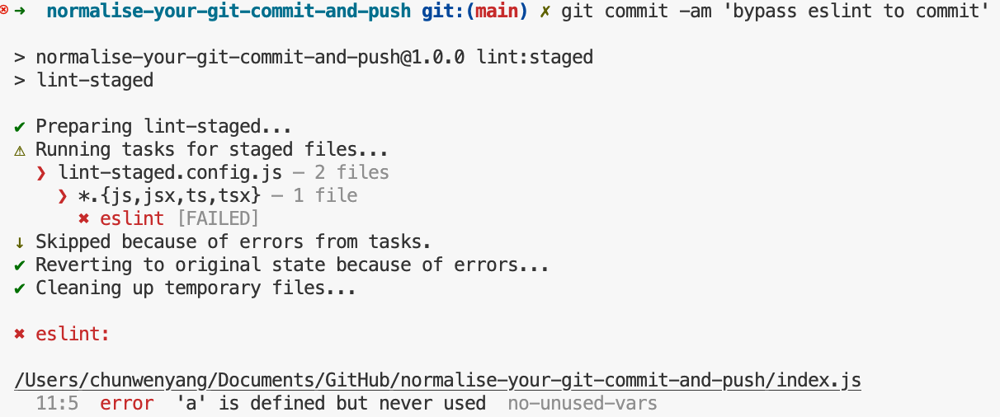

this is because we have an `exit 1` in `package.json`

```json
"scripts": {
    "test": "echo \"Error: no test specified\" && exit 1",
```

Changing it to `exit 0` will ensure the commit works.

**In a real production codebase, you should specify your real `test` command, like Jest, Playwright, etc.**

## linting Setting

### install & init your linting tool

```sh
npm install -D eslint@9 @eslint/js@9
```
> I use @9 here to make my method work in this version, just in case, like, on the day you read this, the version of `ESLint` will change, if you should not be using v9, and it has some breaking changes, you may need to find another way of solution.

create `eslint.config.js` with the code below:

```js
import pluginJs from "@eslint/js";

export default [
  pluginJs.configs.recommended
];
```

### add the linting script to `package.json`

```json
"scripts": {
    "lint": "eslint ."
```

### create a demo `index.js` file

```js
export const field = {
    "b": process.evn.bit,
}
```

### try to lint it

```sh
npm run lint
```

it will show some errors

```console
/workspaces/normalise-your-git-commit-and-push (main) $ npm run lint

> normalise-your-git-commit-and-push@1.0.0 lint
> eslint .


/workspaces/normalise-your-git-commit-and-push/index.js
  2:10  error  'process' is not defined  no-undef

✖ 1 problem (1 error, 0 warnings)

```

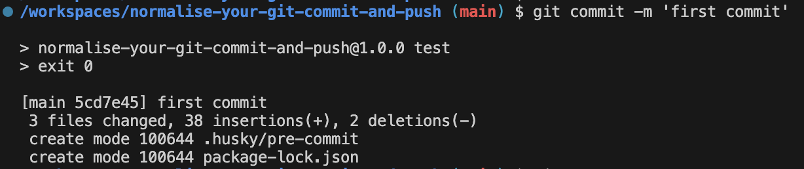

## Add linting to Git (Commit) Hook

### put lint command to your Git hook

add `npm run lint` to the first line of `.husky/pre-commit`

```sh
sed -i '1i npm run lint' .husky/pre-commit
```

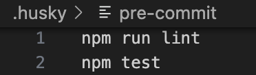

### try committing

```sh
git add .
```

```sh
git commit -m 'second commit'
```

```console
/workspaces/normalise-your-git-commit-and-push (main) $ git commit -m 'second commit'

> normalise-your-git-commit-and-push@1.0.0 lint
> eslint .


/workspaces/normalise-your-git-commit-and-push/index.js
  2:10  error  'process' is not defined  no-undef

✖ 1 problem (1 error, 0 warnings)

husky - pre-commit script failed (code 1)
```

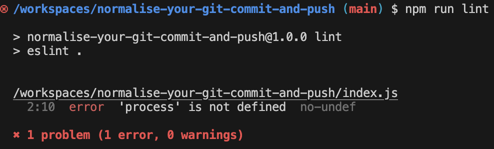

you'll fail because you have to fix all the linting errors before committing the code.

### Fix the linting errors

fix it by editing your `index.js`

```js
const process = {
    env: {
        bit: 2
    }
}

export const field = {
    "b": process.evn.bit,
}

```

and commit again and it will work

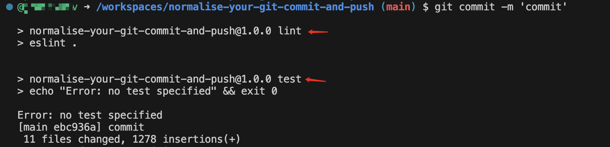

> Notice: **both `npm run lint` and `npm test` in `pre-commit` need to pass before you can commit**

Notice: This way of linting is insufficient; for improved linting, please refer to my other post.

## Commit Message Format

### Install commit message linting tools

```sh
npm install --save-dev @commitlint/{cli,config-conventional}
```

### Configure commit message linting tools

```sh
echo "export default { extends: ['@commitlint/config-conventional'] };" > commitlint.config.js
```

### Test commit message linting tools

```sh
npx commitlint --from HEAD~1 --to HEAD --verbose
```

You will encounter this error:

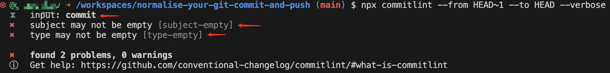

### Why you fail?

The **test** above is mimicing a commit command of `git commit -m 'commit'`.

In this case your **commit message** is `"commit"`,

But we have the **rule** of commit message **format** which is configured in `commitlint.config.js`, stipulating the commit message should be structured as [follows](https://www.conventionalcommits.org/en/v1.0.0/#summary):

```txt
<type>[optional scope]: <description>

[optional body]

[optional footer(s)]
```

i.e. your commit message must be at least like `"feat: your commit description ..."`,

Your message of `"commit"` couldn't satisfy the rule, means you commit will fail.

## Add Commit Message Format Rules to Git (Commit) Hook

### add linting script to a hook

```sh
echo "npx --no -- commitlint --edit \$1" > .husky/commit-msg
```

you'll see a new created file `.husky/commit-msg` with the content below:

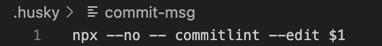

### Test the hook

```sh
git add .
```

```sh
git commit -m "this will fail"
```

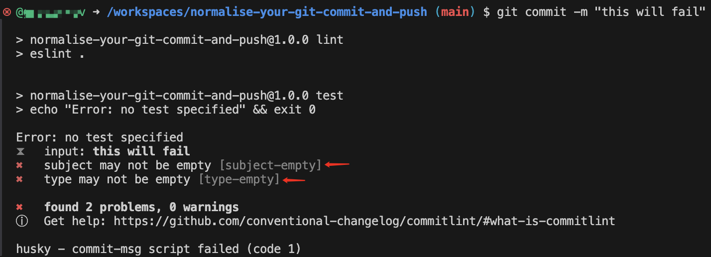

```sh
git commit -m "foo: this will also fail"
```

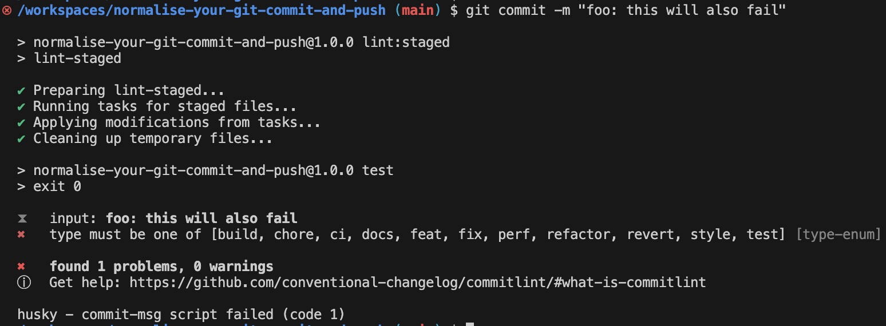

```sh
git commit -m "chore: this is a legal commit message"
```

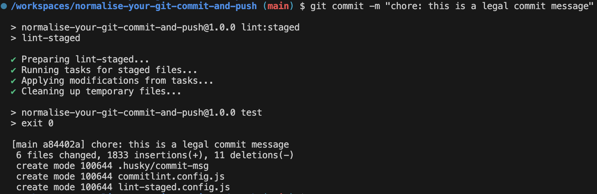

## Tailor your commit message format

The [conventional commit message](https://www.conventionalcommits.org/en/v1.0.0/#summary) may not fulfill your team's requirement.

Sometimes you need to customise your rules.

For instance, your team is using [Jira](https://www.atlassian.com/software/jira) for project and product management as well as issue tracking etc., you and your teammates make an appointment that, every commit should have a Jira ticket id, so you can trace back the real motivation (a product requirement, a technical optimization, a bug, etc.) of every code chage.

To do this, edit your `commitlint.config.js` as below:

```js
export default {
  extends: ['@commitlint/config-conventional'],
  plugins: [
    {
      rules: {
        'subject-prefix-with-jira-ticket-id': parsed => {
          const { subject } = parsed
          const match = subject ? subject.match(/^\[[A-Z]{3,5}-\d+\]\s/) : null
          if (match) return [true, '']
          return [
            false,
            `The commit message's subject must be prefixed with an uppercase JIRA ticket ID.
    A correct commit message should be like: feat: [JIRA-1234] fulfill this feature
    Your subject: ${subject}
    Please revise your commit message.
    `
          ]
        }
      }
    }
  ],
  rules: {
    'subject-prefix-with-jira-ticket-id': [2, 'always']
  }
}
```

Now test it.

```sh
git commit -m 'chore: try to commit'
```

Oops!

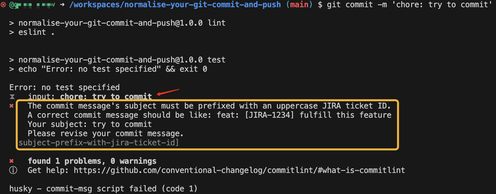

Try another one:

```sh
git commit -m 'chore: [PRJ-1234] a commit with sample id'
```

Gotcha!

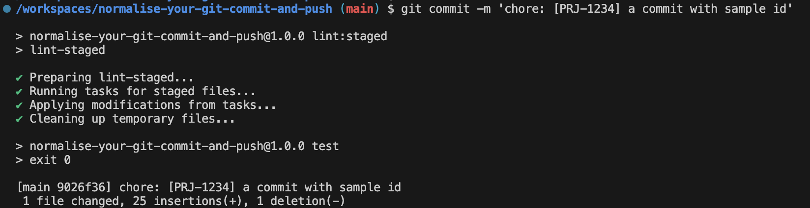

## Add Git (Push) Hook

## DIY

you should DIY your Git commit/push hooks to tailor your team's workflow, like

- implement your specific rules of commit message format after discussing with your teammates
- only lint code in a commit, then test code in a push
- only lint code in a commit, then lint & test code in a push
- both lint & test in commits and pushes
- add other commands or scripts to your Git commit/push hooks, for example, push an IM message, or send an Email, to notify your teammates of your changes.
- use your imagination to do whatever you want ...
