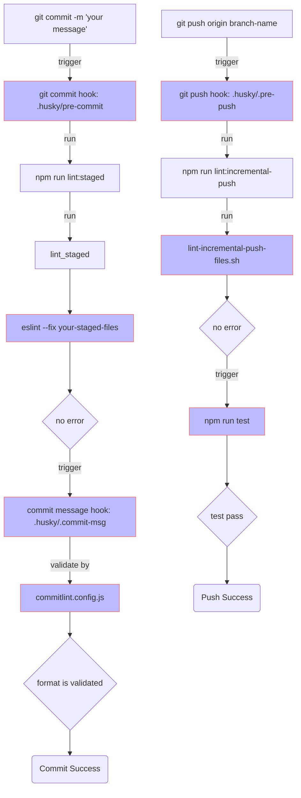
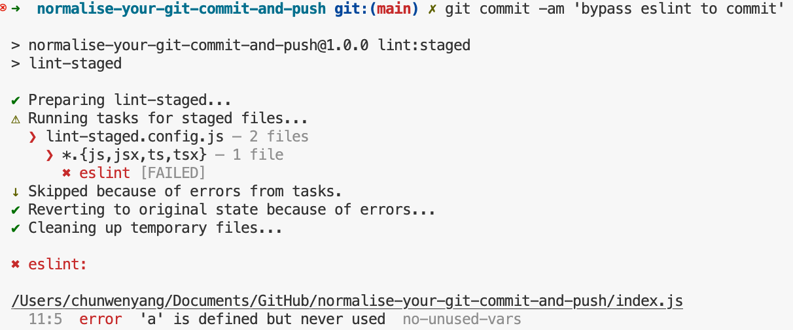
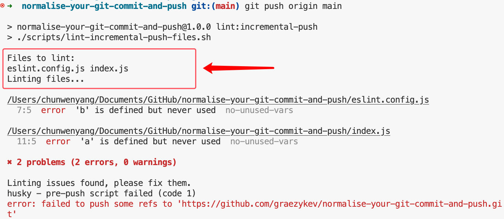

## Introduction

Catch a glimpse of what I'm going to do in this post.



### GitHub Repo

If you prefer to run the demo I've written rather than following the steps one by one, check out this [GitHub repository](https://github.com/graezykev/normalise-your-git-commit-and-push) to get a quick overview.

## Key Takeaways

First I would like to outline all the steps I'm gonna elaborate on in this post.

1. [Init your Project](#1-init-your-project-if-you-havent)
2. [Git Commit Hook](#2-git-commit-hook)
3. [Simple Code Linting](#3-simple-code-linting)
4. [Add Linting to Git Commit Hook](#4-add-linting-to-git-commit-hook)
5. [lint-staged](#5-lint-staged)
6. [Commit Message Hook](#6-commit-message-hook)
7. [Add Commit Message Format Rules to Commit Message Hook](#7-add-commit-message-format-rules-to-commit-message-hook)
8. [Tailor your Commit Message Format](#8-tailor-your-commit-message-format)
9. [Git Push Hook](#9-git-push-hook)
10. [Incremental Push Code Linting](#10-incremental-push-code-linting)
11. [Test the Incremental Linting](#11-test-the-incremental-linting)
12. [Force test before push](#12-force-test-before-push)

But don't worry, every step is clear and straightforward.

## 1. Init your Project (if you haven't)

### Init NPM

```sh
mkdir normalise-your-git-commit-and-push && \
cd normalise-your-git-commit-and-push && \
npm init -y && \
npm pkg set type="module"
```

### Init Git Repo

```sh
git init && \
echo 'node_modules' >> .gitignore
```

## 2. Git Commit Hook

### Install Git Hook Tools

```sh
npm install -D husky@9
```

### Init Git Hook Tools

```sh
npx husky init
```

What does it mainly do?

- create `hooksPath = .husky/_` in `.git/config`

- create `.husky/_/husky.sh`, `.husky/_/h` etc.

- create a `.husky/pre-commit` hook

- create a `prepare` script in `package.json` with the command `husky`

> `husky` is in some way included within `husky init`.

- create `.gitignore` in `.husky/_`

### Try It Out

```sh
git add .
```

```sh
git commit -m 'first commit'
```

Here is what you'll see from the terminal console.


This is because we have an `exit 1` in `package.json`.

```json
"scripts": {
  "test": "echo \"Error: no test specified\" && exit 1",
```

Changing it to `exit 0` will make the commit work.

```diff
"scripts": {
-  "test": "echo \"Error: no test specified\" && exit 1",
+  "test": "exit 0",
```


> **In a real production codebase, you should specify your real `test` command, like Jest, Playwright, etc.**

## 3. Simple Code Linting

For now, we only have a `test` command in our **pre commit** hook, next, we're going to supplement it with a **Linting** command, to check the **Code Style** before you commit JS code.

### Install & Configure Linting Tools

```sh
npm install -D eslint@9 @eslint/js@9
```

Create a `eslint.config.js` with the code below.

```js
import pluginJs from "@eslint/js";

export default [
  pluginJs.configs.recommended
];
```

> Note: I use `export default xxx` here because my `package.json` includes the configuration `"type": "module"`. If you don't have this configuration, use `module.exports = xxx` instead.

### Add Linting Script to `package.json`

```diff
"scripts": {
+  "lint": "eslint .",
```

### Create a Demo `index.js`

```js
export const field = {
    "b": process.evn.bit,
}
```

### Lint the Demo

```sh
npm run lint
```

This will produce some errors because we haven't defined the variable `process` in the Demo code, which is not allowed in the ESLint rule.


## 4. Add Linting to Git Commit Hook

### Put Linting Command to Git Commit hook

Add `npm run lint` to the first line of `.husky/pre-commit`

```diff
+ npm run lint
npm test
```

You can edit it directly, or do it by the command below.

```sh
sed -i '1i npm run lint' .husky/pre-commit
```

### Try to Commit

Now all commits will trigger the run of this linting command.

```sh
git add .
```

```sh
git commit -m 'second commit'
```


You'll fail because you have to fix all the linting errors (we mentioned above) before committing the code.

### Fix the Linting Errors

Fix it by editing `index.js`.

```diff
+const process = {
+    env: {
+        bit: 2
+    }
+}

export const field = {
    "b": process.evn.bit,
}

```

Commit again, it will work.


By now, **both `npm run lint` and `npm test` in `pre-commit` need to pass before you can commit**.

### Better Linting

This way of linting is insufficient in a production project, to integrate a robust linting tool chain, you can checkout another post of mine to learn: [Configure ESLint in a TypeScript project to adhere to Standard JS](https://github.com/graezykev/ts-eslint-standard-js).

## 5. lint-staged

Have you noticed the problem of `npm run lint` in `pre-commit`?

Yes, **all your JS files in the project** are checked in this process, what is the problem though?

Say, you're working on a historical project with hundreds of JS files, and it never integrated linting tools and Git commit hooks before, i.e. there may be numerous code style issues in those existing code.

Today you integrate these linting tools and Git commit hooks, and tomorrow your teammate edits merely one JS file, but he can't commit it because he will be facing all the linting issues at a time which is thrown out by `npm run lint`.

Let me give another example. You spent a day working on developing a web page and you've written some `header.js`, `aside.js`, `main.js`, `footer.js` ... But, only the `header.js` is finished, the others are still under development.

Now it's 5 o'clock, time to call it a day! You decide to commit `header.js` first, but you encounter similar obstacles as the former example.

What we need is a way of committing some **"incremental code"**, or more correctly elaborate by the Git terminology **staged** files.

In simple terms, **staged** files are those files you've added to the **[Git Staging Area](https://git-scm.com/book/en/v2/Getting-Started-What-is-Git%3F#_the_three_states)** by `git add <filename>`.

Only those codes in the staging area should be **linted** in each commit.

Now let's make it done.

### Install lint-staged

```sh
npm install -D lint-staged
```

### Configure lint-staged

Create a `lint-staged.config.js` in the project root with the configuration below.

```js
export default {
  // you can lint other kind of files with other tools
  "*.{js,jsx,ts,tsx}": [
    // you can also add other tools to lint you JS here
    "eslint"
  ]
}

var b // I put this line to elicit an error output in ESLint on purpose
```

> Note: I use `export default xxx` here because my `package.json` includes the configuration `"type": "module"`. If you don't have this configuration, use `module.exports = xxx` instead.

### Add lint-staged command to NPM script

```diff
  "lint": "eslint .",
+  "lint:staged": "lint-staged",
```

And of course modify your hook command with it in `.husky/pre-commit`.

```diff
-npm run lint
+npm run lint:staged
```

### Use lint-staged

```sh
git add lint-staged.config.js
```

```sh
git commit -m 'test lint-staged'
```

This time, only the **newly added (staged)** file `lint-staged.config.js` is checked in your commit. You don't need to fix all your JS files in the project, nor even all the JS files you have modified, but just the **staged** file(s) you really want to commit.


### lint-staged other files

There are more linting tools I won't go too deep but you can integrate with `lint-staged`, such as lint your CSS contents by [Stylelint](https://stylelint.io/), or event lint your README files by [markdownlint](https://github.com/DavidAnson/markdownlint), etc.

## 6. Commit Message Hook

### Install Commit Message Linting tools

```sh
npm install --save-dev @commitlint/{cli,config-conventional}
```

### Configure Commit Message Linting Tools

```sh
echo "export default { extends: ['@commitlint/config-conventional'] };" > commitlint.config.js
```

> Note: I use `export default xxx` here because my `package.json` includes the configuration `"type": "module"`. If you don't have this configuration, use `module.exports = xxx` instead.

### Test Commit Message Linting Tools

```sh
npx commitlint --from HEAD~1 --to HEAD --verbose
```

> "from HEAD~1 to HEAD" is your latest commit

You will encounter this error:


### Why Dose It Fail?

The test case above is mimicking a commit command of `git commit -m 'commit'`.

In this case your **commit message** is `"commit"`, but we have the **rule** of commit message **format** which is configured in `commitlint.config.js`, stipulating the commit message should be structured as [follows](https://www.conventionalcommits.org/en/v1.0.0/#summary):

```txt
<type>[optional scope]: <description>

[optional body]

[optional footer(s)]
```

i.e. your commit message must be at least like `"feat: your commit description ..."`,

Your message of `"commit"` couldn't satisfy the rule, which means your commit will fail.

## 7. Add Commit Message Format Rules to Commit Message Hook

### Add Linting Script to the Hook

```sh
echo "npx --no -- commitlint --edit \$1" > .husky/commit-msg
```

You'll see a newly created file `.husky/commit-msg` with the content below:

`.husky/commit-msg`:

```diff
+npx --no -- commitlint --edit \$1
```

### Test the Hook

```sh
git add .
```

```sh
git commit -m "this will fail"
```


```sh
git commit -m "foo: this will also fail"
```


```sh
git commit -m "chore: this is a legal commit message"
```


## 8. Tailor your Commit Message Format

The [conventional commit message](https://www.conventionalcommits.org/en/v1.0.0/#summary) may not fulfil your team's requirement.

Sometimes you need to customise your rules.

For instance, your team is using [Jira](https://www.atlassian.com/software/jira) for project and product management as well as issue tracking etc., you and your teammates make an appointment that, every commit should have a Jira ticket ID, so you can trace back the real motivation (a product requirement, a technical optimization, a bug, etc.) of every code change.

To do this, edit your `commitlint.config.js` as below:

```js
export default {
  extends: ['@commitlint/config-conventional'],
  plugins: [
    {
      rules: {
        'subject-prefix-with-jira-ticket-id': parsed => {
          const { subject } = parsed
          const match = subject ? subject.match(/^\[[A-Z]{3,5}-\d+\]\s/) : null
          if (match) return [true, '']
          return [
            false,
            `The commit message's subject must be prefixed with an uppercase JIRA ticket ID.
    A correct commit message should be like: feat: [JIRA-1234] fulfill this feature
    Your subject: ${subject}
    Please revise your commit message.
    `
          ]
        }
      }
    }
  ],
  rules: {
    'subject-prefix-with-jira-ticket-id': [2, 'always']
  }
}
```

> Note: I use `export default xxx` here because my `package.json` includes the configuration `"type": "module"`. If you don't have this configuration, use `module.exports = xxx` instead.

Now test it.

```sh
git commit -m 'chore: try to commit'
```

Oops!


Try another one:

```sh
git commit -m 'chore: [PRJ-1234] a commit with sample id'
```

Gotcha!


## 9. Git Push Hook

A **Git Push Hook** is the hook which is triggered before the push. You can use Git Push Hook as another **"firewall"** to validate the code before they are pushed to the remote repository.

## 10. Incremental Push Code Linting

Although we have run `npm run lint:staged` in `pre-commit`, does it ensure that there will be no unchecked code committed?

No, because you can still do this:

```sh
git add . && \
git commit -m 'whatever I like' --no-verify
```

See the `--no-verify` flag? This causes a **forced commit** which is a hidden time bomb! You're even not able to stop your teammates from doing it sneakily!

So, we need a second defence line before those **forced committed** codes are pushed to our remote repository and contaminate the codebase.

Create a shell script file named `scripts/lint-incremental-push-files.sh` with the code below.

In this shell script, we'll find out those **incremental** JS files we want to **push**, and run the ESLint command only on them.

```sh
#!/bin/bash

# Ensure you have the latest info from your remote
git fetch

# Automatically identify the current branch and corresponding remote branch
BRANCH=$(git rev-parse --abbrev-ref HEAD)
REMOTE_BRANCH="origin/${BRANCH}"

# Find the last commit from the remote branch that has been pushed
LAST_PUSHED_COMMIT=$(git rev-parse ${REMOTE_BRANCH})

# Find the current commit
CURRENT_COMMIT=$(git rev-parse HEAD)

# List changed files since the last pushed commit that match the desired extensions
CHANGED_FILES=$(git diff --name-only $LAST_PUSHED_COMMIT $CURRENT_COMMIT | grep -E '\.(js|jsx|ts|tsx)$')

echo "Files to lint:"
echo $CHANGED_FILES

# Run ESLint on these files if any are found
if [ -z "$CHANGED_FILES" ]
then
    echo "No JavaScript/TypeScript files to lint."
else
    echo "Linting files..."
    ./node_modules/.bin/eslint $CHANGED_FILES
    if [ $? -ne 0 ]; then
        echo "Linting issues found, please fix them."
        exit 1
    fi
fi

```

Make the script executable:

```sh
chmod +x scripts/lint-incremental-push-files.sh
```

Add this script to a NPM script in `package.json`.

```diff
  "scripts": {
    "prepare": "husky",
    "lint": "eslint .",
    "lint:staged": "lint-staged",
+    "lint:incremental-push": "./scripts/lint-incremental-push-files.sh",
    "test": "exit 0"
  },
```

Create the **Git Push Hook** named `.husky/pre-push`, and add the NPM script to it.

```sh
echo "npm run lint:incremental-push" > .husky/pre-push
```

Now this shell script will run every time before your push, no **forced committed** code can pass!

## 11. Test the Incremental Linting

Open `index.js` to add a simple line.

```diff
+var a
```

You can not commit it because we have a `pre-commit` hook to lint the file.

```sh
git commit -am 'bypass eslint to commit'
```



But you can bypass the check with `--no-verify`

```sh
git commit -am 'bypass eslint to commit' --no-verify
```

Do a similar thing to `eslint.config.js` with a new line.

```diff
+var b
```

Bypass the check script again.

```sh
git commit -am 'bypass eslint again to commit' --no-verify
```

Now, we have 2 commits including `index.js` and `eslint.config.js`, in which there're ESLint issues, but they are committed by tricks (`--no-verify`).

But don't panic, because they won't be able to be pushed because they will face the punishment of the **Git Push Hook** we made above!

If you push the code.

```sh
git push origin main
```

All **incremental errors** will be caught!



## 12. Force `test` before push

Let's modify our team's workflows.

Now I have decided to allow **linted** code **commits**, without the `test` verification.

However, we will permit code **pushes** only if they have already passed the **test** verification.

Therefore, we will move the `npm test` command from the **Git Commit Hook** hook to the **Git Push Hook** named `pre-push`.

To do that, edit `./husky/pre-commit`:

```diff
npm run lint:staged
- npm test
```

And put this `test` command to the **Git Push Hook**.

```sh
echo "npm test" >> .husky/pre-push
```

Let's edit the `package.json`'s `test` command to force the test to fail.

```diff
"scripts": {
-  "test": "exit 0",
+  "test": "exit 1",
```

Now if you try to push whatever code you'll fail because we have an `exit 1` in the command.

```sh
git push origin main
```


Revert `exit 1` to `exit 0`, or use your **real test scripts** that can pass, your code push to the remote repository will succeed!

## Conclusion: DIY your Workflows

You should DIY your Git commit/push hooks to tailor your team's workflow, like

- implement your specific rules of commit message format after discussing with your teammates
- only lint code in a commit, then test code in a push
- only lint code in a commit, then lint & test code in a push
- both lint & test in commits and pushes
- add other commands or scripts to your Git commit/push hooks, for example, push an IM message, or send an Email, to notify your teammates of your changes.
- use your imagination to do whatever you want ...
