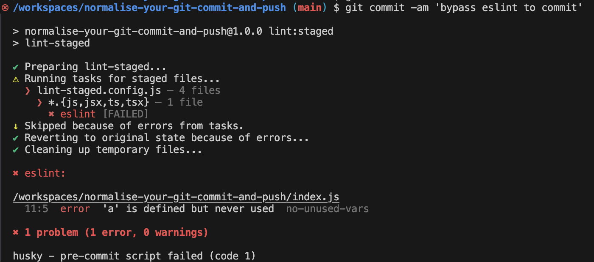

## Introduction

Catch a glimpse of what I'm going to do in this post.

<https://www.mermaidchart.com/app/projects/8ce67b87-532b-4cc1-ac6b-b699b102c0de/diagrams/f4d8ba46-56ff-42a7-8637-73f29036db28/version/v0.1/edit>

### GitHub Repo

If you prefer to run the demo I've written rather than following the steps one by one, check out this [GitHub repository](https://github.com/graezykev/normalise-your-git-commit-and-push) to get a quick overview.

## 1. Init your Project (if you haven't)

### Init NPM

```sh
mkdir normalise-your-git-commit-and-push && \
cd normalise-your-git-commit-and-push && \
npm init -y && \
npm pkg set type="module"
```

### Init Git Repo

```sh
git init && \
echo 'node_modules' >> .gitignore
```

## Git Hook Setting

### Install Git Hook Tools

```sh
npm install -D husky@9
```

### Init Git Hook Tools

```sh
npx husky init
```

What does it mainly do?

- create `hooksPath = .husky/_` in `.git/config`

- create `.husky/_/husky.sh`, `.husky/_/h` etc.

- create a `.husky/pre-commit` hook

- create a `prepare` script in `package.json` with the command `husky`

> `husky` is in some way included within `husky init`.

- create `.gitignore` in `.husky/_`

### Try It Out

```sh
git add .
```

```sh
git commit -m 'first commit'
```

Here is what you'll see from the terminal console.


This is because we have an `exit 1` in `package.json`.

```json
"scripts": {
  "test": "echo \"Error: no test specified\" && exit 1",
```

Changing it to `exit 0` will make the commit works.

```diff
"scripts": {
-  "test": "echo \"Error: no test specified\" && exit 1",
+  "test": "exit 0",
```


> **In a real production codebase, you should specify your real `test` command, like Jest, Playwright, etc.**

## Simple Code Linting Setting

For now, we only have a `test` command in our **pre commit** hook, next, we're going to supplement it with a **Linting** command, to check the **Code Style** before you commit JS code.

### Install & Configure Linting Tools

```sh
npm install -D eslint@9 @eslint/js@9
```

Create a `eslint.config.js` with the code below.

```js
import pluginJs from "@eslint/js";

export default [
  pluginJs.configs.recommended
];
```

### Add Linting Script to `package.json`

```diff
"scripts": {
+  "lint": "eslint .",
```

### Create a Demo `index.js`

```js
export const field = {
    "b": process.evn.bit,
}
```

### Lint the Demo

```sh
npm run lint
```

This will produce some errors, because we haven't defined the variable `process` in the Demo code, which is not allowed in the ESLint rule.


## Add Linting to Git Commit Hook

### Put Linting Command to Git Commit hook

Add `npm run lint` to the first line of `.husky/pre-commit`

```diff
+ npm run lint
npm test
```

You can edit it directly, or do it by the command below.

```sh
sed -i '1i npm run lint' .husky/pre-commit
```

### Try to Commit

Now all commits will trigger the run of this linting command.

```sh
git add .
```

```sh
git commit -m 'second commit'
```


You'll fail because you have to fix all the linting errors (we mentioned above) before committing the code.

### Fix the Linting Errors

Fix it by editing `index.js`.

```diff
+const process = {
+    env: {
+        bit: 2
+    }
+}

export const field = {
    "b": process.evn.bit,
}

```

Commit again, it will work.


By now, **both `npm run lint` and `npm test` in `pre-commit` need to pass before you can commit**.

### Better Linting

This way of linting is insufficient in a production project, to integrate a robust linting tool chain, I think you need to checkout another post of mine [Configure ESLint in a TypeScript project to adhere to Standard JS](https://github.com/graezykev/ts-eslint-standard-js)

## lint-staged

### Install lint-staged

```sh
npm install -D lint-staged
```

### Configure lint-staged

Create a `lint-staged.config.js` with the configuration below.

```js
export default {
  // you can lint other kind of files with other tools
  "*.{js,jsx,ts,tsx}": [
    // you can also add other tools to lint you JS here
    "eslint"
  ]
}

var b // I put this line to elicit an error output in ESLint on purpose
```

### Add lint-staged command to NPM script

```diff
  "lint": "eslint .",
+  "lint:staged": "lint-staged",
```

And of course modify your hook command with it in `.husky/pre-commit`.

```diff
-npm run lint
+npm run lint:staged
```

### Use lint-staged

```sh
git add lint-staged.config.js
```

```sh
git commit -m 'test lint-staged'
```

This time, only the **new added** file `lint-staged.config.js` is checked in you commit. You dont need to fix all you JS file in the project, nor even all the JS files you have modified, but just the **staged** file(s) you really want to commit.


### lint-staged other files

There're more linting tools I won't go too deep but you can integrate with `lint-staged`, such as, lint your css contents by [Stylelint](https://stylelint.io/), or event lint your README files by [markdownlint](https://github.com/DavidAnson/markdownlint), etc.

## Commit Message Format

### Install Commit Message Linting tools

```sh
npm install --save-dev @commitlint/{cli,config-conventional}
```

### Configure Commit Message Linting Tools

```sh
echo "export default { extends: ['@commitlint/config-conventional'] };" > commitlint.config.js
```

### Test Commit Message Linting Tools

```sh
npx commitlint --from HEAD~1 --to HEAD --verbose
```

> "from HEAD~1 to HEAD" is you latest commit

You will encounter this error:


### Why Dose It Fail?

The test case above is mimicing a commit command of `git commit -m 'commit'`.

In this case your **commit message** is `"commit"`, but we have the **rule** of commit message **format** which is configured in `commitlint.config.js`, stipulating the commit message should be structured as [follows](https://www.conventionalcommits.org/en/v1.0.0/#summary):

```txt
<type>[optional scope]: <description>

[optional body]

[optional footer(s)]
```

i.e. your commit message must be at least like `"feat: your commit description ..."`,

Your message of `"commit"` couldn't satisfy the rule, means you commit will fail.

## Add Commit Message Format Rules to Git (Commit Message) Hook

### Add Linting Script to the Hook

```sh
echo "npx --no -- commitlint --edit \$1" > .husky/commit-msg
```

You'll see a new created file `.husky/commit-msg` with the content below:

`.husky/commit-msg`:

```diff
+npx --no -- commitlint --edit \$1
```

### Test the Hook

```sh
git add .
```

```sh
git commit -m "this will fail"
```


```sh
git commit -m "foo: this will also fail"
```


```sh
git commit -m "chore: this is a legal commit message"
```


## Tailor your Commit Message Format

The [conventional commit message](https://www.conventionalcommits.org/en/v1.0.0/#summary) may not fulfill your team's requirement.

Sometimes you need to customise your rules.

For instance, your team is using [Jira](https://www.atlassian.com/software/jira) for project and product management as well as issue tracking etc., you and your teammates make an appointment that, every commit should have a Jira ticket id, so you can trace back the real motivation (a product requirement, a technical optimization, a bug, etc.) of every code chage.

To do this, edit your `commitlint.config.js` as below:

```js
export default {
  extends: ['@commitlint/config-conventional'],
  plugins: [
    {
      rules: {
        'subject-prefix-with-jira-ticket-id': parsed => {
          const { subject } = parsed
          const match = subject ? subject.match(/^\[[A-Z]{3,5}-\d+\]\s/) : null
          if (match) return [true, '']
          return [
            false,
            `The commit message's subject must be prefixed with an uppercase JIRA ticket ID.
    A correct commit message should be like: feat: [JIRA-1234] fulfill this feature
    Your subject: ${subject}
    Please revise your commit message.
    `
          ]
        }
      }
    }
  ],
  rules: {
    'subject-prefix-with-jira-ticket-id': [2, 'always']
  }
}
```

Now test it.

```sh
git commit -m 'chore: try to commit'
```

Oops!


Try another one:

```sh
git commit -m 'chore: [PRJ-1234] a commit with sample id'
```

Gotcha!


## Git Push Hook

A **Git Push Hook** is the hook which is trigger before push. You can use Git Push Hook as another **fire-wall** to validate the code before they are pushed to the remote repository.

### Lint your Code Again before Pushing

Although we have run `npm run lint:staged` in `pre-commit`, does it ensure that there will be no unchecked code committed?

No, because you can still do this:

```sh
git add . && \
git commit -m 'whatever I like' --no-verify
```

See the `--no-verify` flag? This causes a **forced commit** which is a hidden time bomb!

We need the second defense line before those **forced committed** code are pushed to our remote repository and contaminate the codebase.

Create a shell script file named `scripts/lint-incremental-push-files.sh` with the code below.

In this shell script, we'll find out those **incremental** JS/TS files we want to **push**, and run ESLint command only on them.

```sh
#!/bin/bash

# Ensure you have the latest info from your remote
git fetch

# Automatically identify the current branch and corresponding remote branch
BRANCH=$(git rev-parse --abbrev-ref HEAD)
REMOTE_BRANCH="origin/${BRANCH}"

# Find the last commit from the remote branch that has been pushed
LAST_PUSHED_COMMIT=$(git rev-parse ${REMOTE_BRANCH})

# Find the current commit
CURRENT_COMMIT=$(git rev-parse HEAD)

# List changed files since the last pushed commit that match the desired extensions
CHANGED_FILES=$(git diff --name-only $LAST_PUSHED_COMMIT $CURRENT_COMMIT | grep -E '\.(js|jsx|ts|tsx)$')

echo "Files to lint:"
echo $CHANGED_FILES

# Run ESLint on these files if any are found
if [ -z "$CHANGED_FILES" ]
then
    echo "No JavaScript/TypeScript files to lint."
else
    echo "Linting files..."
    ./node_modules/.bin/eslint $CHANGED_FILES
    if [ $? -ne 0 ]; then
        echo "Linting issues found, please fix them."
        exit 1
    fi
fi

```

Make the script executable:

```sh
chmod +x scripts/lint-incremental-push-files.sh
```

Add this script to a NPM script in `package.json`.

```diff
  "scripts": {
    "prepare": "husky",
    "lint": "eslint .",
    "lint:staged": "lint-staged",
+    "lint:incremental-push": "./scripts/lint-incremental-push-files.sh",
    "test": "exit 0"
  },
```

Create the **Git Push Hook** named `.husky/pre-push`, and add the NPM script to it.

```sh
echo "npm run lint:incremental-push" > .husky/pre-push
```

Now this shell script will run every time before your push, no **forced committed** code can pass!

### Force `test` before push

Let's modify our team's workflows.

Now I decide to allow only **linted** code **commits** without **test** verification.

However, we will permit code **pushes** only if they have already passed the **test** verification.

Therefore, we will move the `npm test` command from the **Git Commit Hook** hook to the **Git Push Hook** named `pre-push`.

To do that, edit `./husky/pre-commit`:

```diff
npm run lint:staged
- npm test
```

And create the **Git Push Hook** with the test command.

```sh
echo "npm test" > .husky/pre-push
```

Let's edit the `package.json`'s `test` command to force the test to fail.

```diff
"scripts": {
-  "test": "exit 0",
+  "test": "exit 1",
```

Now if you try to push the code (of course you need to commit it first) you'll fail because we have a `exit 1` in the command.

```sh
git push origin main
```



Revert `exit 1` to `exit 0`, or use your **real test scripts** that can pass, your code push to the remote repository will success!

## DIY

you should DIY your Git commit/push hooks to tailor your team's workflow, like

- implement your specific rules of commit message format after discussing with your teammates
- only lint code in a commit, then test code in a push
- only lint code in a commit, then lint & test code in a push
- both lint & test in commits and pushes
- add other commands or scripts to your Git commit/push hooks, for example, push an IM message, or send an Email, to notify your teammates of your changes.
- use your imagination to do whatever you want ...
