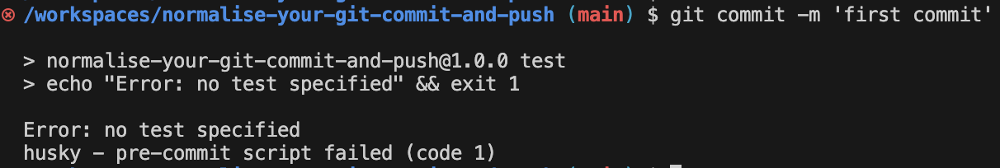
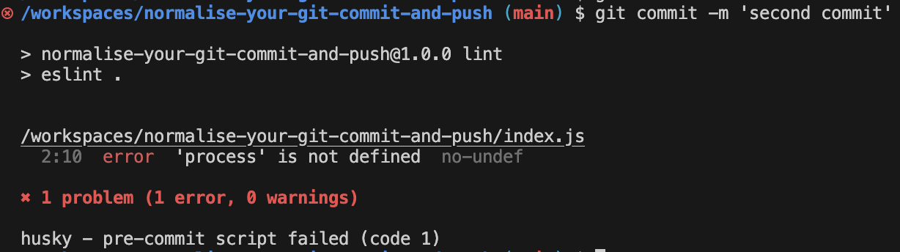
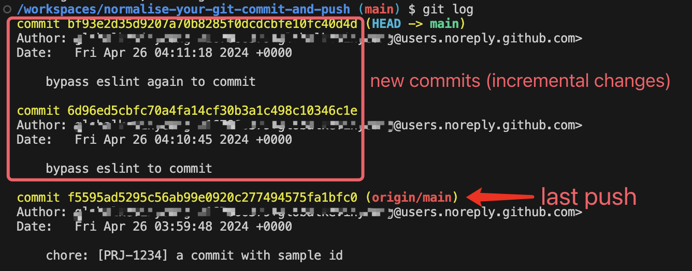

# Normalise Your Git Commit and Push Processes

**Using `husky`, `eslint`, `lint-stage`, `commitlint` and straightforward Shell scripts.**

## Introduction

Today's topic revolves around leveraging Git Hooks to streamline Git workflows, focusing on code linting before commits and pushes, and standardizing the format of commit messages.

**Git Hooks** are essentially **custom scripts** that trigger during key Git actions.

There are two categories of Git Hooks: **client-side** and **server-side**. Client-side hooks are activated by operations such as committing, merging, and pushing, whereas server-side hooks are triggered by network operations, like receiving pushed commits.

In this post, I will primarily discuss client-side hooks. I'll delve into three specific hooks: **pre-commit**, **commit-msg**, and **pre-push**. The central tool discussed will be [Husky](https://typicode.github.io/husky/), which simplifies the configuration of Git Hooks, making it more straightforward.

Here’s a preview of what I will cover in this post:


### GitHub Repo

If you'd prefer to run the demo I've created instead of following the steps individually, check out this [GitHub repository](https://github.com/graezykev/normalise-your-git-commit-and-push) for a quick overview and hands-on experience.

## Key Takeaways

I would like to outline all the steps I'm gonna elaborate on in this post.

Tedious? Don't worry, each step is clear and straightforward. **Most of the time, you can copy and paste my commands and codes to follow the guide**.

- 1 - [Init your Project](#1-init-your-project-if-you-havent)

- 2 - [Git Pre-Commit Hook](#2-git-pre-commit-hook)

  - 2.1 - [Create Pre-Commit Hook](#21-create-pre-commit-hook)
  
  - 2.2 - [Code Linting](#22-code-linting)
  
  - 2.3 - [Integrate Linting into the Pre-Commit Hook](#23-integrate-linting-into-the-pre-commit-hook)
  
  - 2.4 - [Brief Sum-Up](#24-brief-sum-up)

- 3 - [lint-staged](#3-lint-staged)

- 4 - [Commit Message Hook](#4-commit-message-hook)

  - 4.1 - [Commit Message Format Linting](#41-commit-message-format-linting)
  
  - 4.2 - [Add Message Format Linting to Commit Message Hook](#42-add-message-format-linting-to-commit-message-hook)
  
  - 4.3 - [Tailor your Commit Message Format](#43-tailor-your-commit-message-format)

- 5 - [Git Push Hook](#5-git-push-hook)

  - 5.1 - [Incremental Code Linting](#51-incremental-code-linting)
  
  - 5.2 - [Force test Before Push](#52-force-test-before-push)
  
  - 5.3 - [Force Push](#53-force-push)

## 1. Init your Project (if you haven't)

### Init NPM

```sh
mkdir normalise-your-git-commit-and-push && \
cd normalise-your-git-commit-and-push && \
npm init -y && \
npm pkg set type="module"
```

### Init Git Repo

```sh
git init && \
echo 'node_modules' >> .gitignore
```

## 2. Git Pre-Commit Hook

The **Git Pre-Commit Hook** is triggered just after you execute the `git commit` command, but before the commit message editor is opened (if you are not using the `-m` option), or before the commit is finalized (if you are using the `-m` option).

What is commit message editor?

The most simple way of specifying our commit message is to execute `git commit -m 'my commit message'`. However, there's a more interactive way to commit using `git commit`.


After you run `git commit` without the `-m` option and commit message, Git typically opens an editor for you to enter a commit message (This editor could be Vim, Emacs, Nano, or whatever your default command-line text editor is set to).

Returning to the **Git Pre-Commit Hook**, it is triggered before the editor is opened, or before Git receives you commit message if you're using `-m`.

We can use it to perform checks (such as running the ESLint command), and if these checks fail, the commit action is blocked.

By sharing this **hook script**, you can ensure that every teammate commits only code that has been checked.

Let's explore how we can accomplish this.

### 2.1. Create Pre-Commit Hook

#### Install Husky

The first important step is to install Husky.

```sh
npm install -D husky@9
```

#### Init Husky

```sh
npx husky init
```

It's necessary to break down what primarily happens after the execution of `husky init`.

- Create the directory `.husky/_` and add the configuration of `hooksPath = .husky/_` to `.git/config`.

  The `.husky/_` contains the actual hook scripts that Husky will execute in response to specific Git events.

  By setting `hooksPath = .husky/_`, it tells Git to look for hooks in the `.husky/_` directory instead of the default `.git/hooks`.

- Create executable scripts such as `.husky/_/husky.sh` and `.husky/_/h` etc.

  `.husky/_/husky.sh` is the primary script that Husky injects into the hooks it manages, and `.husky/_/h` is its Shortcut.

- Create a script `.husky/pre-commit` with the command `npm test`.

  This executable file is the actual **Git Pre-Commit Hook** we mentioned before, whatever **user-defined** behaviours you want to add should be placed here.

  It's invoked by `.husky/_/husky.sh`.

  The `npm test` in it means: You want to commit the code? Oh, you have to pass the test first.

- Create the `prepare` command in `package.json` with the execution of `husky`.

  Anyone who clones your Git repo and runs `npm install` will automatically invoke the `prepare` script. Then, `husky` will initiate `.husky/_` and configure `.git/hooks`.

- Create a `.gitignore` in `.husky/_` with a single line `*`.

  This prevents everything inside `.husky/_` from being pushed to the remote repository.

  Why should `.husky/_` be excluded from Git version control?

  The scripts under `.husky/_` should be generated dynamically according to different environments' configurations and behaviors (machines, operating systems, CI environments, etc.).

  For example, the Windows system uses `\` as a path separator, while Linux uses `/`. Each system may have `Node.js` installed in a specific path. Each system may have its own `Node.js` version.

  ...

  You cannot create scripts that can be universally applied unless you're working inside the specific environment.

#### Try A Commit

Since our `pre-commit` hook has been initiated, let's try it.

```sh
git add .
```

```sh
git commit -m 'first commit'
```

Here is what you'll see from the terminal console:



It fails because the pre-commit hook runs the `test` job, which contains an `exit 1`, in the `test` script of `package.json`.

```json
"scripts": {
  "test": "echo \"Error: no test specified\" && exit 1",
```

Changing it to `exit 0` will make the commit work.

```diff
"scripts": {
-  "test": "echo \"Error: no test specified\" && exit 1",
+  "test": "exit 0",
```

Commit again:

```sh
git add . && \
git commit -m 'first commit'
```


> **In a real production project, you should specify your actual `test` command, such as Jest, Playwright, etc.**

### 2.2. Code Linting

For now, our **pre-commit** hook only includes a `test` command. Next, we'll add a Lint command to check the **Code Style** before you commit JavaScript code.

#### Install & Configure Linting Tools

Before Linting code in pre-commit hook, let's install and configure ESLint.

```sh
npm install -D eslint@9 @eslint/js@9
```

Create an `eslint.config.js` file with the code below:

```js
// eslint.config.js

import pluginJs from "@eslint/js";

export default [
  pluginJs.configs.recommended
];
```

> Note: I use `export default xxx` here because my `package.json` includes the configuration `"type": "module"`. If you don't have this configuration, use `module.exports = xxx` instead.

#### Add Linting Script to `package.json`

```diff
"scripts": {
+  "lint": "eslint .",
```

#### Create a Demo `index.js`

```js
// index.js

export const field = {
    "b": process.evn.bit,
}
```

#### Lint the Demo

```sh
npm run lint
```

This will produce some errors because we haven't defined the variable `process` in the demo code, which is not allowed according to the ESLint rule.


### 2.3. Integrate Linting into the Pre-Commit Hook

In the last step, we configured a command to lint our code style. Now, we're going to integrate it with the pre-commit hook.

#### Put Linting Command to Pre-Commit hook

Add `npm run lint` to the first line of `.husky/pre-commit`.

```diff
+npm run lint
npm test
```

#### Try A Commit

Now, all commits will trigger the execution of this linting command.

```sh
git add . && \
git commit -m 'second commit'
```

You'll encounter a failure because you must fix all the linting errors (mentioned above) before committing the code.



#### Fix the Linting Errors

Fix it by editing `index.js`:

```diff
// index.js

+const process = {
+    env: {
+        bit: 2
+    }
+}

export const field = {
    "b": process.evn.bit,
}

```

Commit again and it should work.

```sh
git add . && \
git commit -m 'commit after fix index.js'
```


### 2.4. Brief Sum-Up

By now, **both `npm run lint` and `npm test` must pass in the `pre-commit` hook before you can commit code**.

#### Better Linting

I only made a very simple ESLint configuration here, which may be insufficient for a production project. To integrate a robust linting toolchain, you can check out another post of mine to learn more: [Configure ESLint in a TypeScript Project to Adhere to Standard JS](https://github.com/graezykev/ts-eslint-standard-js/blob/main/steps.md).

## 3. lint-staged

Have you noticed the problem with `npm run lint` in the `pre-commit`?

Yes, **all your JavaScript files in the project** are checked in this process. What is the problem, though?

Suppose you're working on a historical project with hundreds of JavaScript files that had never integrated linting tools or Git hooks before, meaning there may be numerous code style issues in the existing code.

Today, you integrated ESLint and Git commit hooks into the project, and tomorrow your teammate edits just one JavaScript file. However, they can't commit it because they are overwhelmed by all the historical linting issues in the whole project at once, which are identified by `npm run lint`.

Here’s another example:

You've spent a day developing a web page and have written several files like `header.js`, `aside.js`, `main.js`, `footer.js`, etc. But, only `header.js` is complete, the others are still under development.

Now it's 5 o'clock, time to call it a day! You decide to commit `header.js` first, but you encounter similar obstacles as in the previous example.

What we need is a way to commit only the **"code we really want to commit right now"**, or more correctly, by Git terminology, the **staged** files.

In simple terms, **staged** files are those files you've added to the **[Git Staging Area](https://git-scm.com/book/en/v2/Getting-Started-What-is-Git%3F#_the_three_states)** by `git add <filename>`.

Only the code in the staging area should be linted with each commit.

Now, let's see how to get it done.

### Install lint-staged

[lint-staged](https://github.com/lint-staged/lint-staged) is the second important tools we need here, install it via NPM.

```sh
npm install -D lint-staged
```

### Configure lint-staged

Create a `lint-staged.config.js` file in the project root with the configuration below:

```js
// lint-staged.config.js

export default {
  // You can lint other types of files with different tools.
  "*.{js,jsx,ts,tsx}": [
    // You can also add other tools to lint your JavaScript here.
    "eslint"
  ]
}

var b // I included this line to intentionally elicit an error output in ESLint later.
```

> Note: I use `export default xxx` here because my `package.json` includes the configuration `"type": "module"`. If you don't have this configuration, use `module.exports = xxx` instead.

### Add lint-staged to NPM Script

```diff
  "lint": "eslint .",
+ "lint:staged": "lint-staged",
```

And of course, modify your hook command accordingly in `.husky/pre-commit`.

```diff
-npm run lint
+npm run lint:staged
```

### Use lint-staged

Annotate the following code from `index.js`:

```diff
// index.js

+// const process = {
+//    env: {
+//        bit: 2
+//    }
+// }

export const field = {
    "b": process.evn.bit,
}

```

In this scenario, we have ESLint issues in both `lint-staged.config.js` and `index.js`, but let's say we don't want to commit `index.js` and ignore its ESLint issues for now.

To let `lint-staged` identify what you're going to commit, first add the file you want to commit to the Git **Staging Area**.

```sh
git add lint-staged.config.js # don't add index.js
```

Then, commit the file.

```sh
git commit -m 'test lint-staged'
```


This time, only the **newly added**(staged) file `lint-staged.config.js` is checked during your commit.

`index.js` was changed, and it obviously has ESLint errors, but it's not **staged**, so it's not checked in this commit.

You don't need to fix all the JavaScript files in the project, nor even all the JavaScript files you have modified, but just the **staged** file(s) you actually want to commit.

Let's comment out the line `var b` in `lint-staged.config.js` to fix its ESLint error, and then the commit will succeed.

```diff
-var b // I included this line to intentionally elicit an error output in ESLint later.
+// var b // I included this line to intentionally elicit an error output in ESLint later.
```

```sh
git add lint-staged.config.js && \
git commit -m 'test lint-staged'
```


### lint-staged Other Files

There are more linting tools that I won't go into deeply, but you can integrate them with `lint-staged`. For example, you can lint your **CSS** content with [Stylelint](https://stylelint.io/), or even lint your **README** files with [markdownlint](https://github.com/DavidAnson/markdownlint), etc.

### Save other changes

Now we have some unsaved work.

```sh
git status
```


Before we move on to our next Git Hook, let's revert our last change in `index.js` and save our previous work.

```diff
// index.js

-// const process = {
-//    env: {
-//        bit: 2
-//    }
-// }
+const process = {
+    env: {
+        bit: 2
+    }
+}

export const field = {
    "b": process.evn.bit,
}

```

```sh
git add . && \
git commit -m "let's continue"
```


We're going to mention this **"let's continue"** later in our next Git Hook.

## 4. Commit Message Hook

In the previous steps, we introduced the Git Pre-Commit Hook, which activates immediately after you execute the `git commit` command but before the commit message editor opens or the commit is finalized.

And after that, after the Git Pre-Commit Hook is triggered, the next hook is the Commit Message Hook, or specifically speaking, the `commit-msg` script. In this hook, you're able to get the **Commit Message** from the commit message editor or from the message you provide via `git commit -m 'message'`.

Our next step is to validate the **format** of the commit message.

**Why is format of the commit message so important?**

Well, Git commit message is a **semantic** description of what you are going to do in a specific commit. It's a gateway to **communicate** with your teammates, code reviewers are easier to understand your intention without diving into the code.

Git commit message also **improves traceability**, by linking the commit to external resources like bug and task trackers through identifiers or tags, enhancing the traceability of work and the management of project documentation.

That's the significance of adhering to a standard format for commit messages promotes clarity, coherence, and collaboration within a team.

### 4.1. Commit Message Format Linting

#### Install Commit Message Linting Tools

[commitlint](https://commitlint.js.org/) is the most important tool we need for this step.

```sh
npm install --save-dev @commitlint/{cli,config-conventional}
```

#### Configure `commitlint`

Below is a simple (but conventional) configuration, adhering to the [conventional commit format](https://www.conventionalcommits.org/en/v1.0.0/#summary).

```sh
echo "export default { extends: ['@commitlint/config-conventional'] };" > commitlint.config.js
```

> Note: I use `export default xxx` here because my `package.json` includes the configuration `"type": "module"`. If you don't have this configuration, use `module.exports = xxx` instead.

#### Test `commitlint`

Run `commitlint` directly to verify the message we used in our last commit, checking if it meet the [conventional commit format](https://www.conventionalcommits.org/en/v1.0.0/#summary).

```sh
npx commitlint --from HEAD~1 --to HEAD --verbose
```

> "from HEAD~1 to HEAD" is your **latest commit**

You will encounter the error:


#### Why Dose It Fail?

The command above is **mimicking your last commit**.

Do you recall what it was? Yes, it was `git commit -m 'let's continue'`.

In this case, your **commit message** is `"let's continue"`, but we have a **rule** for the commit message **format** configured in `commitlint.config.js`, which stipulates that the commit message should be structured as [follows](https://www.conventionalcommits.org/en/v1.0.0/#summary):

```txt
<type>[optional scope]: <description>

[optional body]

[optional footer(s)]
```

i.e., your commit message must be at least formatted like `"feat: your commit description ..."`.

However, Your message of `"let's continue"` doesn't satisfy the rule, which means your commit will fail.

We'll find out how to fix it later.

### 4.2. Add Message Format Linting to Commit Message Hook

Running `commitlint` directly is not appropriate; we should integrate it into an automatic Git Hook (Commit Message Hook).

#### Add Linting Script to the Hook

Create the Git Commit Message Hook file `.husky/commit-msg` and add execution of `commitlint` to it.

```sh
echo "npx --no -- commitlint --edit \$1" > .husky/commit-msg
```

You'll see a newly created file `.husky/commit-msg` with the content below:

```diff
+npx --no -- commitlint --edit \$1
```

#### Test the Hook

The Commit Message Hook is ready, now test it.

```sh
git add . && \
git commit -m "this will fail"
```

It fails because neither a `type` nor a `subject` is specified.


Make some slightly adjustments:

```sh
git commit -m "foo: this will also fail"
```

As `foo` is not a valid `type`, it fails again, But at least we have **one less problem** than the last commit.


Modify the message once more:

```sh
git commit -m "chore: this is a legal commit message"
```

Hooray!


### 4.3. Tailor your Commit Message Format

In real senarios, the [conventional commit message format](https://www.conventionalcommits.org/en/v1.0.0/#summary) may not meet your team's requirements, sometimes you need to customise your rules.

For instance, your team is using [Jira](https://www.atlassian.com/software/jira) for project and product management, as well as issue tracking, etc. You and your teammates have agreed that every commit should include a Jira ticket ID, allowing you to trace back the real motivation (a product requirement, a technical optimization, a bug, etc.) of every code change.

To do this, edit your `commitlint.config.js` as follows:

```js
// commitlint.config.js

export default {
  extends: ['@commitlint/config-conventional'],
  plugins: [
    {
      rules: {
        'subject-prefix-with-jira-ticket-id': parsed => {
          const { subject } = parsed
          const match = subject ? subject.match(/^\[[A-Z]{3,5}-\d+\]\s/) : null
          if (match) return [true, '']
          return [
            false,
            `The commit message's subject must be prefixed with an uppercase JIRA ticket ID.
    A correct commit message should be like: feat: [JIRA-1234] fulfill this feature
    Your subject: ${subject}
    Please revise your commit message.
    `
          ]
        }
      }
    }
  ],
  rules: {
    'subject-prefix-with-jira-ticket-id': [2, 'always']
  }
}
```

> Note: I use `export default xxx` here because my `package.json` includes the configuration `"type": "module"`. If you don't have this configuration, use `module.exports = xxx` instead.

Test it.

```sh
git add . && \
git commit -m 'chore: try to commit'
```

Oops! The commit fails as we just add a new rule to force a **"JIRA ticket ID"** in the commit message's subject.


Try another one:

```sh
git commit -m 'chore: [PRJ-1234] a commit with sample id' # the [PRJ-1234] is a fake ID
```

You've got it!


## 5. Git Push Hook

We have taken some steps to ensure our code style and commit message format in the previous steps. One further step is to ensure the code quality before it's pushed to the remote repository.

A **Git Push Hook** is triggered before a push (`git push origin <branch>`) occurs. You can use the Git Push Hook as another **"firewall"** to validate the code before it is pushed to the remote repository.

### 5.1. Incremental Code Linting

We have run `npm run lint:staged` in `pre-commit`. Does it ensure that there will be no unchecked code contaminating our codebase?

The answer is **No**. You can still commit code that hasn't been fixed by this:

```sh
git add . && \
git commit -m 'whatever I like' --no-verify
```

See the `--no-verify` flag? It can help you to **skip `pre-commit` and `commit-msg` hooks** we made above.

This allows for a **forced commit**. It's like a hidden time bomb! You're not even able to stop your teammates from doing it sneakily!

So, here we need a second defence line before the **forced committed** code is pushed to our remote repository and pollute the codebase.

I need to clarify what I mean by **Incremental Code** here.

Say we have the following commits: `commit-a` and `commit-b` have been pushed to the remote repository, and `commit-c` to `commit-N` (not sure how many commits in `...`) have not been pushed yet.

| Commit | Commit time | push status |
| -------- | ------- | ------- |
| commit-N | today | not pushed |
| ... | today | not pushed |
| commit-d | today| not pushed |
| commit-c | today | not pushed |
| commit-b | yesterday | pushed |
| commit-a | the-day-before-yesterday | pushed |

Right now, we're going to push from `commit-c` to `commit-N`, and `commit-c` to `commit-N` represent the **incremental code** in this context.

#### First Push

Before making any changes and testing the incremental changes since the last push, it's **important** to **push the code** first.

Because later, we're going to make another push, which will be compared to this push as **Incremental Code**.

```sh
git push origin main
```


#### Incremental Code Linting Shell Script

Create a **Shell script** file named `scripts/lint-incremental-push-files.sh`.

```sh
mkdir scripts && \
touch scripts/lint-incremental-push-files.sh
```

In this Shell script, we'll identify those **incremental** JavaScript files we want to **push**, and then run the ESLint command only on them. Input the following code into `lint-incremental-push-files.sh`.

```sh
#!/bin/bash

# Ensure you have the latest info from your remote
git fetch

# Automatically identify the current branch and corresponding remote branch
BRANCH=$(git rev-parse --abbrev-ref HEAD)
REMOTE_BRANCH="origin/${BRANCH}"

# Find the last commit from the remote branch that has been pushed
LAST_PUSHED_COMMIT=$(git rev-parse ${REMOTE_BRANCH})

# Find the current commit
CURRENT_COMMIT=$(git rev-parse HEAD)

# List changed files since the last pushed commit that match the desired extensions
CHANGED_FILES=$(git diff --name-only $LAST_PUSHED_COMMIT $CURRENT_COMMIT | grep -E '\.(js|jsx|ts|tsx)$')

echo "Files to lint:"
echo $CHANGED_FILES

# Run ESLint on these files if any are found
if [ -z "$CHANGED_FILES" ]
then
    echo "No JavaScript/TypeScript files to lint."
else
    echo "Linting files..."
    ./node_modules/.bin/eslint $CHANGED_FILES
    if [ $? -ne 0 ]; then
        echo "Linting issues found, please fix them."
        exit 1
    fi
fi

```

Make the script executable:

```sh
chmod +x scripts/lint-incremental-push-files.sh
```

Add this script to a NPM script in `package.json`.

```diff
  "scripts": {
    "prepare": "husky",
    "lint": "eslint .",
    "lint:staged": "lint-staged",
+   "lint:incremental-push": "./scripts/lint-incremental-push-files.sh",
    "test": "exit 0"
  },
```

Create the **Git Push Hook** configuration file named `.husky/pre-push`, and add the NPM script to it.

```sh
echo "npm run lint:incremental-push" > .husky/pre-push
```

Now, this Shell script will run every time before your push. Your `git push` command will fail if the incremental code doesn't pass the ESLint check, meaning no **force-committed** code can pass through!

#### Test Incremental Code Linting

Now, let's make some changes.

Open `index.js` to add a simple line.

```diff
// index.js

const process = {
    env: {
        bit: 2
    }
}
    
export const field = {
    "b": process.evn.bit,
}

+var a
```

You **can not** commit it because we have a `pre-commit` hook to lint the file and we just made a ESLint error in it.

```sh
git add . && \
git commit -am 'bypass eslint to commit'
```


But you can bypass the check with `--no-verify`.

```sh
git commit -am 'bypass eslint to commit' --no-verify
```


Do a similar thing to `eslint.config.js` with a new line:

```diff
import pluginJs from "@eslint/js";

export default [
  pluginJs.configs.recommended
];

+var b;
```

Bypass the check process again.

```sh
git add . && \
git commit -am 'bypass eslint again to commit' --no-verify
```

#### Check and Push Incremental Code

Just now, we have two commits including `index.js` and `eslint.config.js`, in which there are actually ESLint issues, but they were committed using tricks (`--no-verify`).



The commits in the red rectangle are the so-called **incremental changes** to be pushed, but they should not be pushed since they have ESLint issues!

But don't panic, we've got your back! They won't be able to be pushed because they will face the punishment of the **Git Push Hook** we made above!

If you try to push the code:

```sh
git push origin main
```

All **Incremental Errors** will be caught!


You can not push them until fix the errors and commit again.

`index.js`:

```diff
-var a
+// var a
```

`eslint.config.js`:

```diff
-var b;
+// var b;
```

```sh
git add . && \
git commit -m 'fix: [TEST-01] fix ESLint errors' && \
git push origin main
```


### 5.2. Force `test` Before Push

Next, I'm going to modify our team's workflow.

I will move the `npm test` command from the **Git  Pre-Commit Hook** hook to the **Git Push Hook** named `pre-push`.

This is because I decide to allow **linted** code **commits**, without the `test` verification. I mean, we allow **"un-test"** code to be commit, but don't allow them to be pushed.

To do that, edit `./husky/pre-commit`:

```diff
npm run lint:staged
- npm test
```

And move the `test` command to the **Git Push Hook**.

```sh
echo "npm test" >> .husky/pre-push
```

Let's edit the `package.json`'s `test` command to intentionally make the test fail:

```diff
"scripts": {
-  "test": "exit 0",
+  "test": "exit 1",
```

Now, if you try to push any code, you'll fail because we have an `exit 1` in the command. This means the `test` process is not passed, preventing you from pushing the **"un-tested"** code to the remote repository.

```sh
git add . && \
git commit -am 'chore: [TEST-1234] test commit'
```


This would have failed if we hadn't removed `npm test` from `pre-commit`.

```sh
git push origin main
```

The push will fail because we just added a `test` in the `pre-push` hook, which means we need to ensure that the `test` succeeds before we can push our code.


Revert `exit 1` to `exit 0`, or in a real production project, use your **actual test scripts** that can pass, your code push to the remote repository will succeed!

### 5.3 Force Push

Unfortunately, you can still bypass the `pre-push` check and force push the code by using the `--no-verify` flag, just as you can force a commit.

```sh
git push origin main --no-verify
```

Or, if you're using GitHub, you can even commit and push your code directly on the website.


To address this, we need **server-side** Git hooks or `CI` systems. However, these are more complex topics, and I won't delve deeply into them now. Perhaps I'll write another post to introduce them in the future.

## Conclusion: DIY your Workflows

In this post, I've delved into detailed steps to normalise our teams' Git workflow. My approach is just a basic framework; there are many Git hooks I haven't mentioned here. You should customize your Git hooks to tailor them to your team's workflow.

For example, you may not agree with me that I move the `npm test` command from the **Git Pre-Commit Hook** to the **Git Push Hook**. Based on this post, I think you already know how to make your own choice and tailor your own workflows.

Here are some additional steps you might consider:

- Make use of the other Git Hooks I didn't introduce in this post to enhance your teamwork, such as `post-checkout`, `post-commit`, `pre-rebase`, etc.
- Implement specific rules for commit message formatting after discussing with your teammates.
- Perform both linting and testing in commits and pushes.
- Add other commands or scripts to your Git commit/push hooks, such as sending an IM message or an email to notify your teammates of your changes.
- Use your imagination to customize the workflow as you see fit.

**Last but not least, any suggestions, corrections, questions, or disagreements will be greatly appreciated.**
